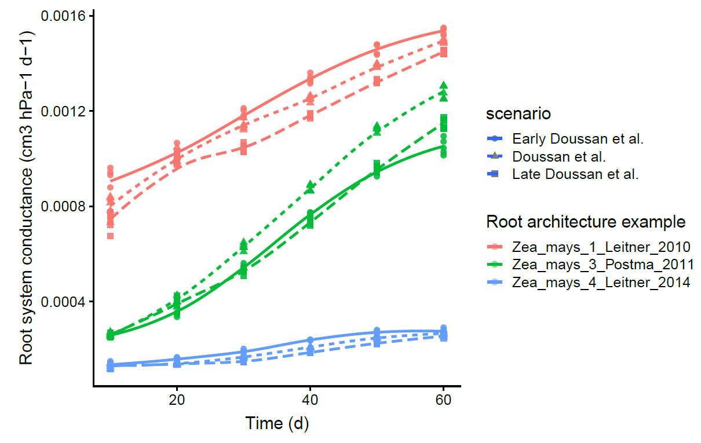
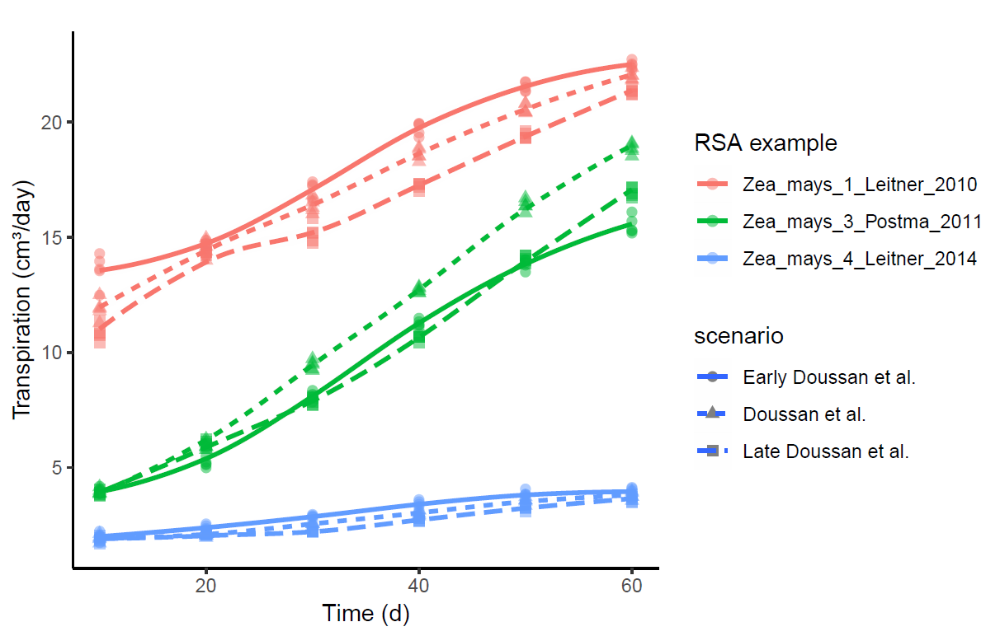
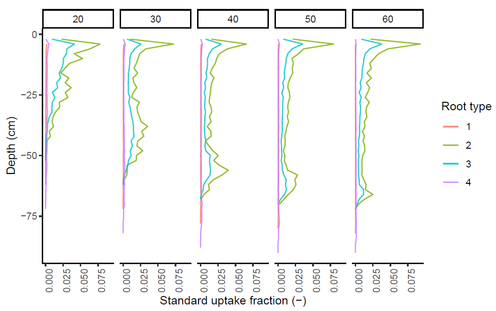
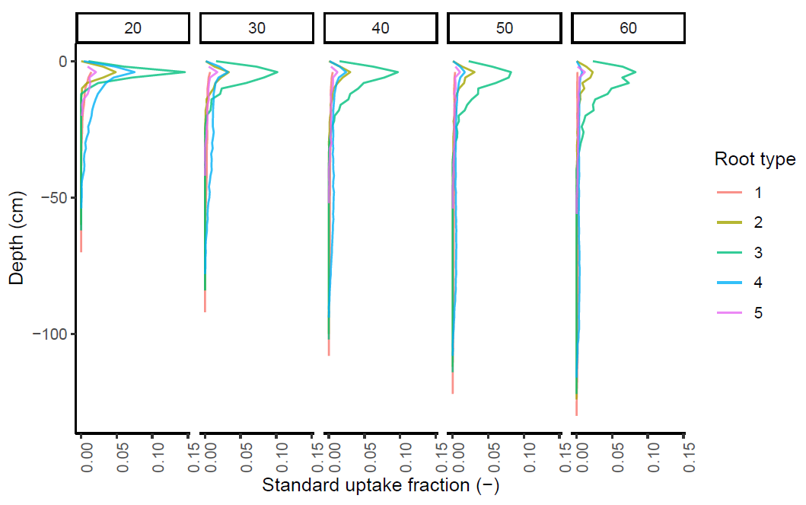
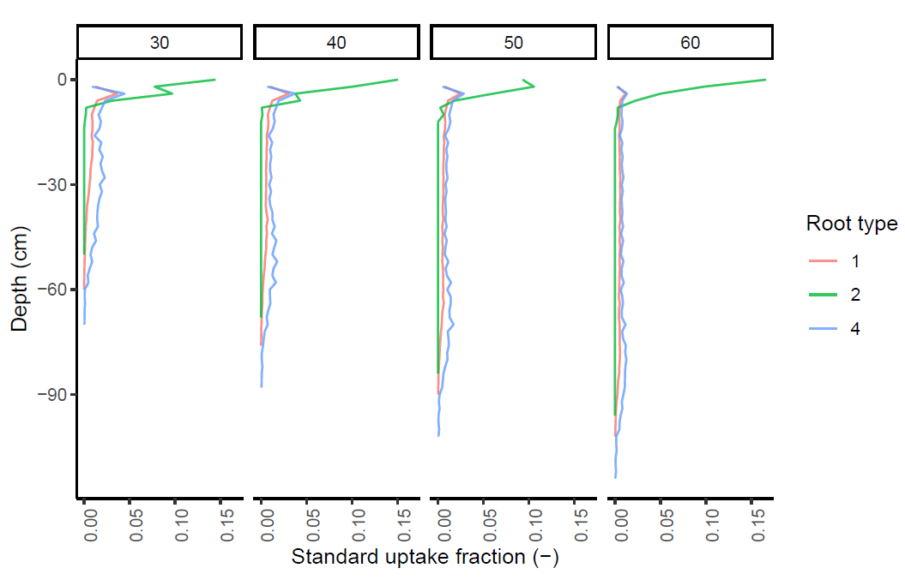
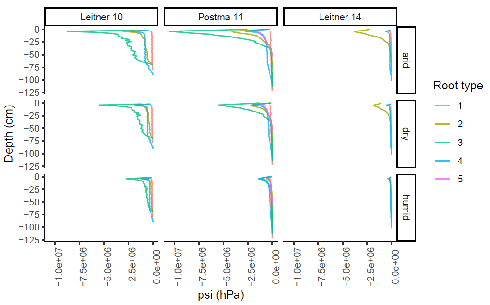

# marshal-pipeline
How to use MARSHAL from the R environment

... in process
draft version PipelineMARSHAL.rmd

## Install MARSHAL

MARSHAL is a R package that can be loaded with the following line of code :
```{r echo=TRUE, eval=FALSE}
install.packages("devtools")
library(devtools)
install_github("MARSHAL-ROOT/marshal")
library(marshal)
```

## Load or create MARSHAL input

- Soil water potential along the depth profile


- Root type conductivities (e.g. Doussan et al., 1998)


- Water pressure head at the collar

`-15.000 hPa`

- Root system architecture (CRootBox)


### Run [CRootBox](https://plant-root-soil-interactions-modelling.github.io/CRootBox/)

The "[a](https://github.com/MARSHAL-ROOT/marshal-pipeline/tree/master/17_06%20CRootBox%20Windows)" executer

```{r}
source("R/io_function.R")

all_roots <- NULL
for(param_name in param_choise){
  # Load param of the selected example
  rparam <- read_rparam(path = paste0("./www/", param_name, ".rparam"))
  pparam <- read_pparam(path = paste0("./www/", param_name, ".pparam"))
  # Overwrite the param files that will be use
  write_rparam(rparam, "./www/param.rparam")
  write_pparam(pparam, "./www/param.pparam")
  
  for(i in c(1:nrep)){
  ################## 
  #  Run CRootBox  #
  ##################
  system("www/a.exe")

  # Get all the .txt files exported by CRootBox
  fls <- list.files("./")
  fls <- fls[grepl("rootsystem.txt", fls)]
  
  for(f in fls){
    temp <- fread(f, header = T)
    temp$age <- strsplit(f, "_")[[1]][1]
    temp$rep <- i
    temp$ex <- param_name
    # Save the temporary data in a permanent file to use.
    all_roots <- rbind(all_roots, temp)
    }
  }
}

```

## Run MARSHAL

`getSUF` function to add hydraulic macro-properties on a root system architecture

### output
- Krs



- Transpiration (Tpot \& Tact)

In wet condition


- SUF, Kr \& Kx

Leitner 2010

Postma 2011

Leitner 2014


- Radial and Axial water fluxes


- water pressure head at the soil-root interface




