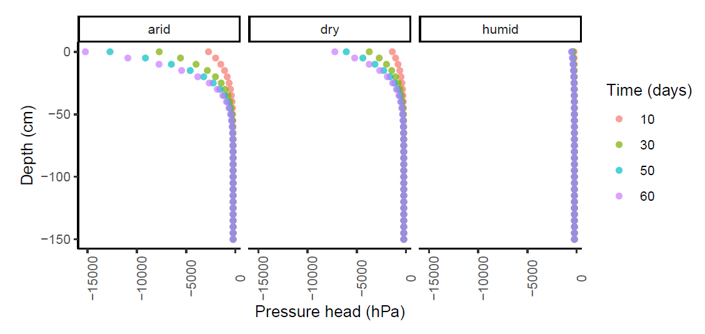
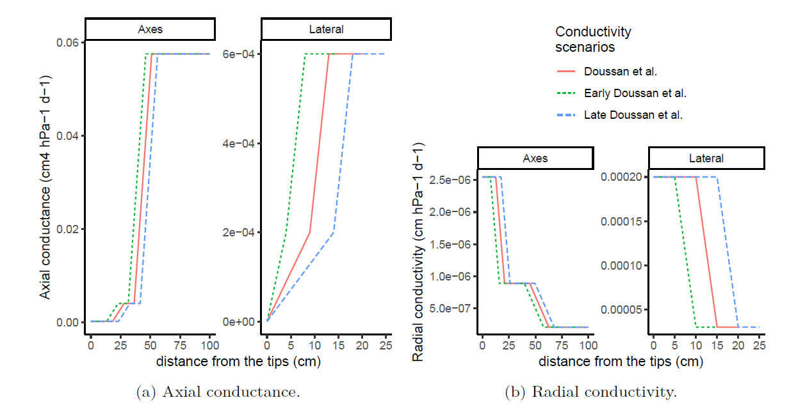
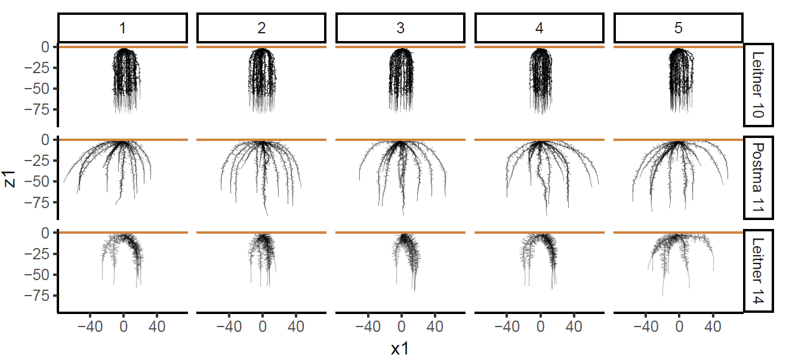
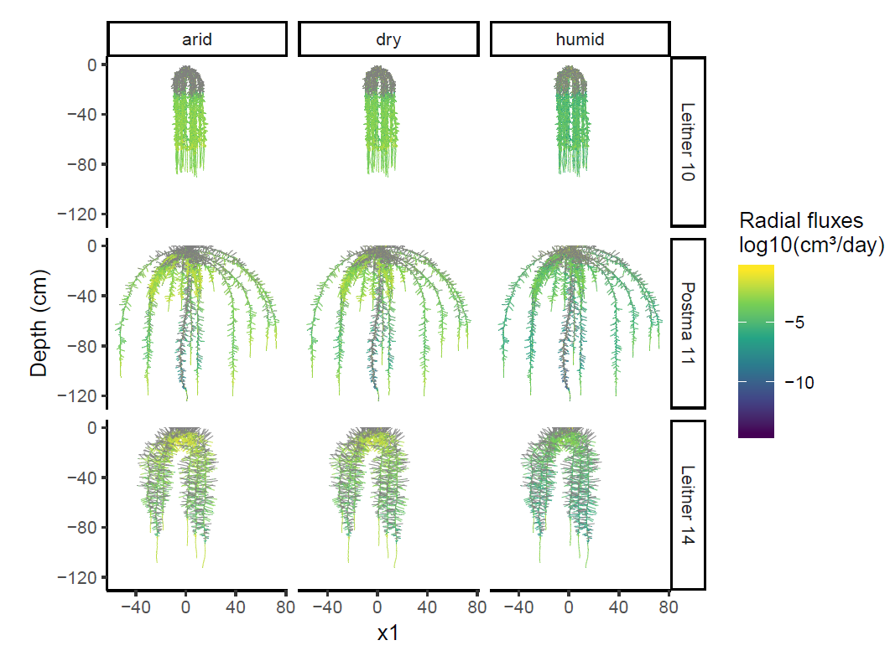
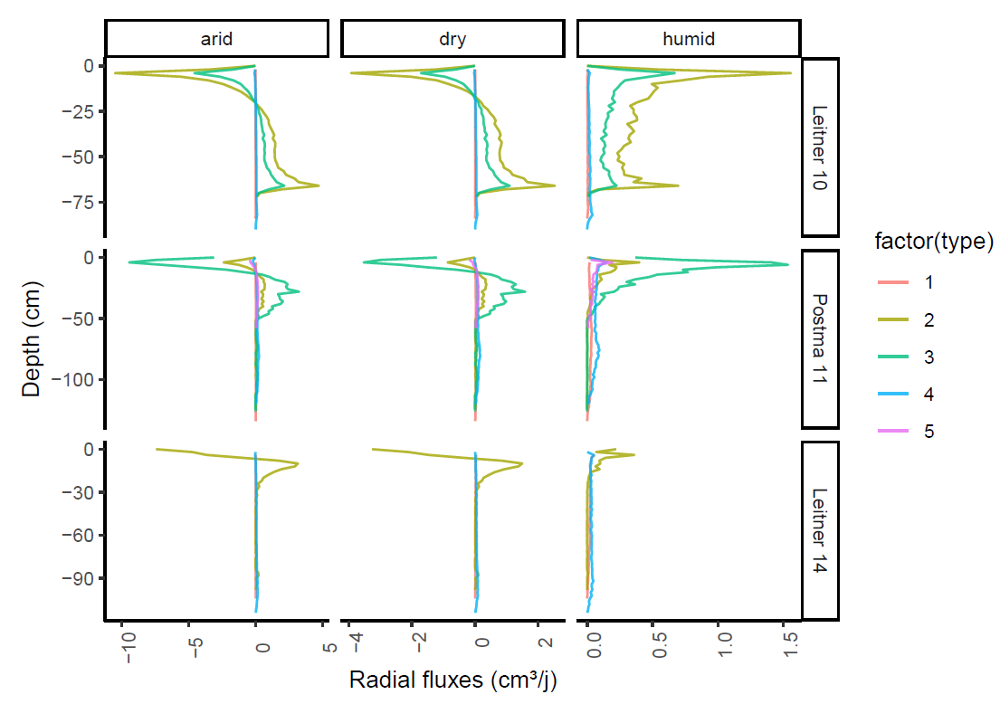

# marshal-pipeline
How to use MARSHAL from the R environment

... in process
draft version PipelineMARSHAL.rmd

## Install MARSHAL

MARSHAL is a R package that can be loaded with the following line of code :
```{r echo=TRUE, eval=FALSE}
install.packages("devtools")
library(devtools)
install_github("MARSHAL-ROOT/marshal")
library(marshal)
```

## Load or create MARSHAL input

- Soil water potential along the depth profile



- Root type conductivities (e.g. Doussan et al., 1998)



- Water pressure head at the collar

- Root system architecture (CRootBox)



### Run [CRootBox](https://plant-root-soil-interactions-modelling.github.io/CRootBox/)

The "[a](https://github.com/MARSHAL-ROOT/marshal-pipeline/tree/master/17_06%20CRootBox%20Windows)" executer

## Run MARSHAL

`getSUF` function to add hydraulic macro-properties on a root system architecture

### output
- Krs

www/fig/Krs.PNG)

- Transpiration (Tpot \& Tact)
- SUF, Kr \& Kx
- Radial and Axial water fluxes
- water pressure head at the soil-root interface

#### Visualize the output




